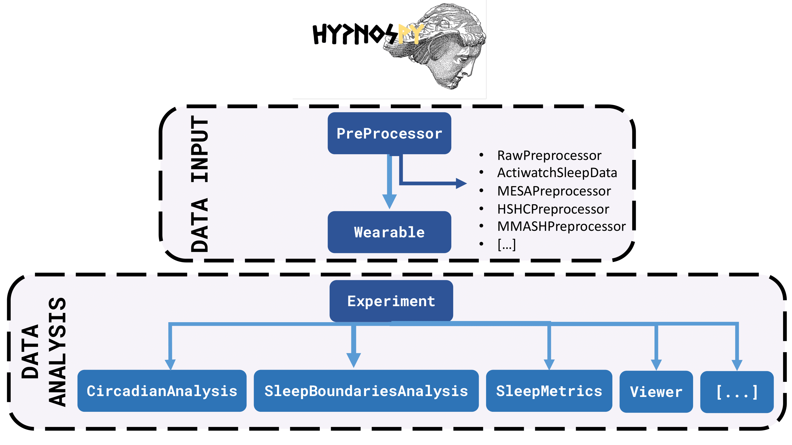
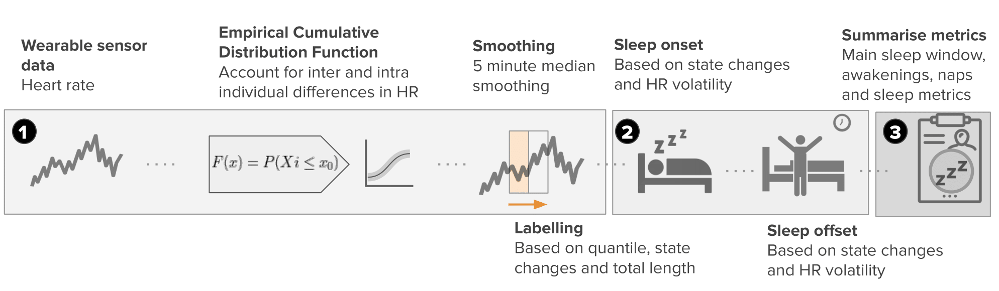
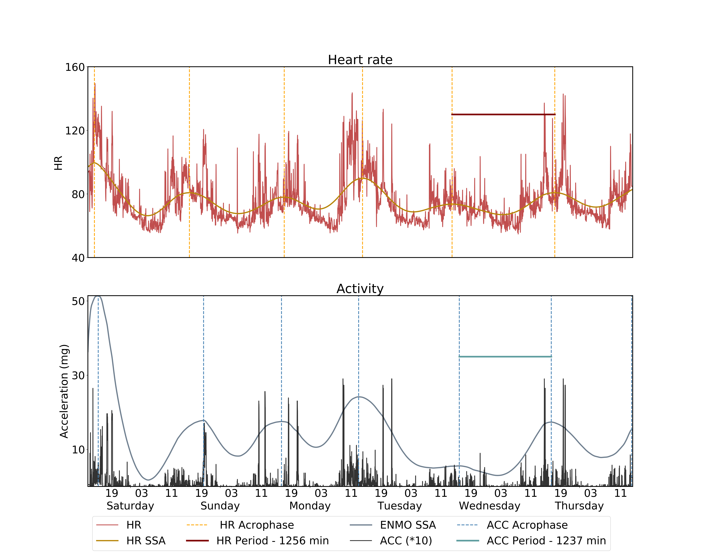
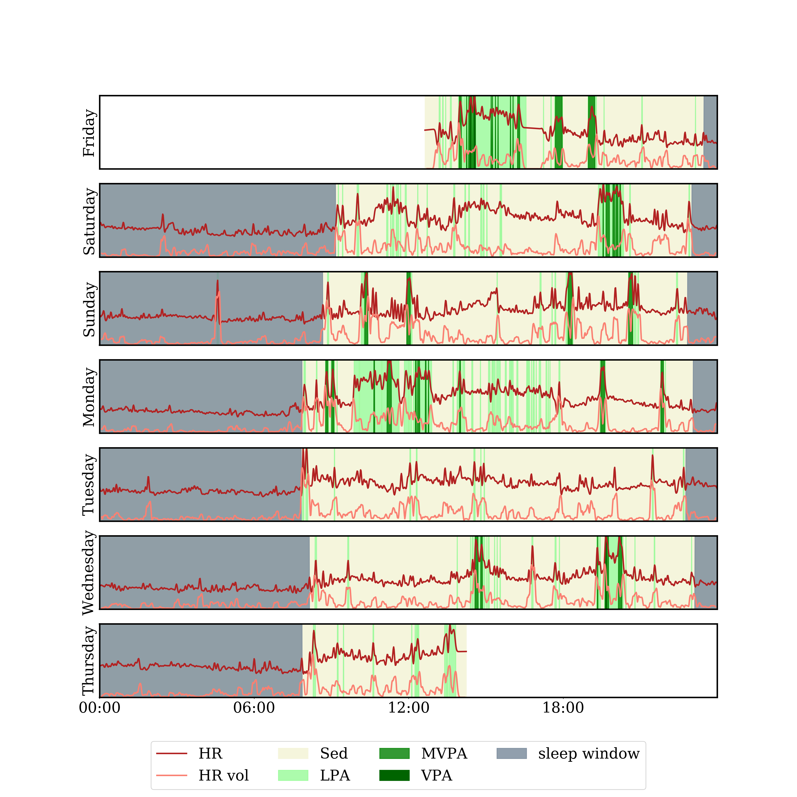

[](https://www.python.org/)
[](https://pypi.python.org/pypi/hypnospy/)
[](https://pypi.python.org/pypi/hypnospy/)
[](https://github.com/ippozuelo/HypnosPy/graphs/commit-activity)
[](https://GitHub.com/ippozuelo/HypnosPy/watchers/)
[](https://GitHub.com/ippozuelo/HypnosPy/stargazers/)

# HypnosPy :sleeping_bed:
A Device-Agnostic, Open-Source Python Software for Wearable Circadian Rhythm and Sleep Analysis and Visualization


# Installation :computer:

You can install HypnosPy with pip in a (bash) shell environment, type:

```
pip install hypnospy
```
To update HypnosPy type:

```
pip install -U hypnospy
```

Dependencies include python 3.7 and the following packages:

```
NumPy,SciPy,Pandas,Matplotlib,Seaborn

```


# Usage :bulb:
Here is a simple example of how you can use HypnosPy in your research:
```python
from hypnospy import Wearable
from hypnospy.data import MESAPreProcessing
from hypnospy.analysis import SleepWakeAnalysis, Viewer, NonWearingDetector

# MESAPreProcessing is a specialized class to preprocess csv files from Philips Actiwatch Spectrum devices used in the MESA Sleep experiment
# MESA Sleep dataset can be found here: https://sleepdata.org/datasets/mesa/
preprocessed = MESAPreProcessing("../data/examples_mesa/mesa-sample.csv")

# Wearable is the main object in HypnosPy.
w = Wearable(preprocessed)

# In HypnosPy, we have the concept of ``experiment day'' which by default starts at midnight (00 hours).
# We can easily change it to any other time we wish. For example, lets run this script with experiment days
# that start at 3pm (15h)
w.change_start_hour_for_experiment_day(15)

# Sleep Wake Analysis module
sw = SleepWakeAnalysis(w)
sw.run_sleep_algorithm("ScrippsClinic", inplace=True) # runs alg and creates new col named 'ScrippsClinic'
sw.run_sleep_algorithm("Cole-Kripke", inplace=True)   # runs alg and creates new col named 'Cole-Kripke'

# View results
v = Viewer(w)
v.view_signals(signal_categories=["activity"], signal_as_area=["ScrippsClinic", "Cole-Kripke", "Oakley"],
               colors={"area": ["green", "red", "blue"]}, alphas={"area": 0.6})

# Easily remove non-wearing epochs/days.
nwd = NonWearingDetector(w)
nwd.detect_non_wear(strategy="choi")
nwd.check_valid_days(max_non_wear_minutes_per_day=180)
nwd.drop_invalid_days()

```
Some of the amazing features of HypnosPy are showcased [here](https://github.com/ippozuelo/HypnosPy/blob/master/mdpi_sensors/).
Try it out! :test_tube:


# Under the hood :mag_right:

**HypnosPy** is a device-agnostic, open-source Python software library for the analysis and visualization of circadian rhythms and sleep using wearable sensors. HypnosPy centralizes most well-established algorithms for the analysis of sleep and circadian rhythms and provides ease of use while supporting a wide array of devices. Augmenting the work introduced by previous packages, HypnosPy allows for the analysis of various signal inputs at different sampling rates (i.e., acceleration, actigraphy and HR in its current release) while also providing with a comprehensive set of tools that allows users to chose how to analyze these signals.

Hypnospy is implemented in Python with standard data science dependencies and uses the object-oriented paradigm. This makes Hypnospy an open-source framework that is both easy to use and to extend (please **join us** for this mission! :rocket:). Data inputs in HypnosPy rely only on the module called **PreProcessor** and its descendants. **PreProcessor** is used to translate the raw data captured by a wearable device (i.e., what is the input data format? A .csv file? What are the columns, if any, for the activity count or heart rate?) to Hypnospy's **Wearable** module. We already provide a set of pre-defined preprocessors for different open collections commonly used in research, such as the Multi-Ethnic Study of Atherosclerosis (MESA) and the Hispanic Community Health Study (HCHS) collections from http://www.sleepdata.org, which have been increasingly used in machine learning and epidemiological studies. Nevertheless, users can easily specific their own preprocessing module using or extending the **PrePreprocessor** module.

While all data analysis in HypnosPy can be performed on one single wearable, Hypnospy provides a layer of abstraction for experiments containing multiple wearables, namely, the **Experiment** module. All further data analysis can be performed on a single wearable or on a set of them (using the **Experimen** module). With Hypnospy, it is straightforward to perform complex data analysis, such as **sleep inferences, circadian analysis or non-wear detection, among many other weearable related functionalities**. At the core of HypnosPy is the modularity and choice of algorithms for these different purposes. A holistic overview of the software architecture is provided in the Figure bellow:

<p style="text-align:center;"></p>

**Hypnospy's** core functionalities can be summarized as follows:

   * *Labelling cohort datasets for clinical and epidemiological sleep research*: HypnosPy allows the user to run most traditional heuristic sleep algorithms, triaxial accelerometry and heart rate-based approaches in a seamless and modular way. The software also supports sleep diary and expert sleep annotation options and can be used to calculate a battery of sleep quality metrics.


   The **HR algorithm** developed by our group consists of the following steps: (1)  Wearable sensor HR data is obtained and pre-processed, setting initial sleep blocks through ECDF quantile thresholds *Q*. (2) Blocks longer than *L* minutes are kept and merged with other blocks if their gap is smaller than *G* minutes. The limits of the resulting blocks are then used as sleep candidates for sleep onset and offset. (3) Then, rolling heart rate volatility is used for the refinement of these candidate times by finding nearby periods where HR volatility is high. In free-living conditions with full-day of recordings, we recommend *Q* to be set to 0.35, *L* to be on the range of 30-40 minutes and $G$ to be between 120-260 minutes. After this process is completed, nap and awakenings are labeled. Naps are obtained from candidate sleep blocks that were not included in the largest sleep window. Awakenings are derived from short periods (<60 minutes) within the sleep window where the heart rate exceeds the daytime threshold. These awakenings labels allow HypnosPy to provide sleep metrics such as the number of nightly awakenings, the total wake time after sleep onset (WASO) and the sleep efficiency (SE), which are widely used in the sleep literature and carry clinical significance. This is summarized in the following figure:
   
   <p style="text-align:center;"></p>


  * *Integration of sleep and physical activity in a chronobiology framework*: HypnosPy enables circadian rhythm analysis, supporting a variety of traditional methods like the cosinor approach as well as more recent ones like Singular Spectrum Analysis (SSA). These tools can be used with HypnosPy's built-in physical activity analysis toolkit to interface the influence of activities in both absolute and relative temporal frameworks. For example, in chronobiology, acrophase refers to a time when a certain biological function is at its periodic, usually daily, maximum. HypnosPy produces not only the physical activity acrophase using both cosinor and SSA, but also the delay between this acrophase and sleep onset and offset. For instance, the figure bellow showcases an example where the software is used in both activity and HR data:
  
  <p style="text-align:center;"></p>


   * *Personalized health monitoring using research and commercial-grade device data*: HypnosPy facilitates the integration of a diverse range of wearables ranging from research grade tools to commercial, readily-available devices. Through this encompassing support, which will continue to grow over time, HypnosPy aims to enable comparative analysis across the growing number of tools available to both researchers and consumers. 
    
      For example, here is a subject labelled with HypnosPy for physical activity and sleep:
   
   <p style="text-align:center;"></p>


# Cite our work! :memo::pencil:

# Contributing :handshake:
We are very keen on having other colleagues contribute to our work and to make this as generalizable as possible of a package.
This project came about due to the frustration of not having a centralized analysis tool that worked across devices, so if you
find our project interesting or think you can improve it, please contribute by:

* reporting bugs (how you got it and if possible, how to solve it)
* adding new tools- if you are interested on this please email one of the main developers, we'd love to hear from you
* adding pre-processing pipelines for new devices. The more, the merrier.
* sharing our work with your colleagues, this will allow the project to improve and not die in this corner of the interweb.
* reaching out!- we are always keen on learning more of how you are using/want to use hypnospy


### License :clipboard:
This project is released under a BSD 2-Clause Licence (see LICENCE file)
### Contributions :man_technologist: :woman_technologist:
* **João Palotti (MIT)** @joaopalotti *main developer*
* **Marius Posa (Cambridge)** @marius-posa *main developer*
* **Abdulaziz Al-Homaid (QCRI)** @abalhomaid *developer*
* **Ignacio Perez-Pozuelo (Cambridge)** @ippozuelo *main developer*
# Research that uses HypnosPy :rocket:

* Perez-Pozuelo, I., Posa, M., Spathis, D., Westgate, K., Wareham, N., Mascolo, C., ... & Palotti, J. (2022). [Detecting sleep outside the clinic using wearable heart rate devices](https://www.nature.com/articles/s41598-022-11792-7). Scientific Reports, 12(1), 1-13.

# Acknowledgements :pray:

* We thank the MRC Epidemiology Unit at Cambridge for supporting some of the research associated to this work as well as the Alan Turing Institute, QCRI and MIT.

