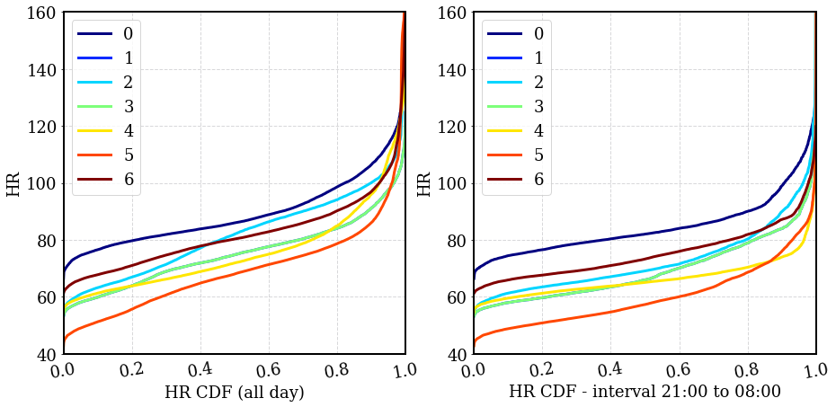

[](https://www.python.org/)
[](https://pypi.python.org/pypi/hypnospy/)
[](https://pypi.python.org/pypi/hypnospy/)
[](https://github.com/ippozuelo/HypnosPy/graphs/commit-activity)
[](https://GitHub.com/ippozuelo/HypnosPy/watchers/)
[](https://GitHub.com/ippozuelo/HypnosPy/stargazers/)

# HypnosPy :sleeping_bed:
A Device-Agnostic, Open-Source Python Software for Wearable Circadian Rhythm and Sleep Analysis and Visualization


# Installation :computer:

You can install HypnosPy with pip in a (bash) shell environment, type:

```
pip install hypnospy
```
To update HypnosPy type:

```
pip install -U hypnospy
```

Dependencies include python 3.7 and the following packages:


# Usage :bulb:
Here is a simple example of how you can use HypnosPy in your research:
```python
from hypnospy import PreProcessing, TimeSeriesProcessing, SleepWakeAnalysis, Wearable

# Preprocessing...
pp = PreProcessing()
pp.load_file("dummy.dta", "dw")

#If trixial→ collapse ENMO to (15’’,30’’)
#Determine sampling rate (15’’, 30’’, 1’) → if not, ERROR (‘Device sampling rate not supported’)
pp.export_hypnospy("dummy.hpy") # -> [ typeOfDevice (triaxial, hr, counts), typeOfStudy(full, night_only), location(dw,ndw,hip,chest,bw,bw_ch,bw_hp,hp_ch,all), additional(diary,anno,PSGlabel), df={ _pid, _time, _acc, _hr?, "PSGLabel"} ]

```

# Under the hood :mag_right:

Here we'll iput a breakdown of the software architecture

<p style="text-align:center;"></p>

Ignacio to provide a breakdown of the main software functionalities here

Circadian

<p style="text-align:center;"></p>


HR algorithm (update)
We found that HR quantiles offered a personalized method to direct our sleeping window search as observed in the figure bellow:
<p style="text-align:center;"></p>

Example

<p style="text-align:center;"></p>


# Cite our work! :memo::pencil:

# Contributing :handshake:
We are very keen on having other colleagues contribute to our work and to make this as generalizable as possible of a package.
This project came about due to the frustration of not having a centralized analysis tool that worked across devices, so if you
find our project interesting or think you can improve it, please contribute by:

* reporting bugs (how you got it and if possible, how to solve it)
* adding new tools- if you are interested on this please email one of the main developers, we'd love to hear from you
* adding pre-processing pipelines for new devices. The more, the merrier.
* sharing our work with your colleagues, this will allow the project to improve and not die in this corner of the interweb.
* reaching out!- we are always keen on learning more of how you are using/want to use hypnospy


### License :clipboard:
This project is released under a BSD 2-Clause Licence (see LICENCE file)
### Contributions :man_technologist: :woman_technologist:
* **João Palotti (MIT)** @joaopalotti *main developer*
* **Marius Posa (Cambridge)** @marius-posa *main developer*
* **Ignacio Perez-Pozuelo (Cambridge)** @ippozuelo *main developer*
# Research that uses HypnosPy :rocket:

* Perez-Pozuelo, I., Posa, M., Spathis, D., Westgate, K., Wareham, N., Mascolo, C., ... & Palotti, J. (2020). Detecting sleep in free-living conditions without sleep-diaries: a device-agnostic, wearable heart rate sensing approach. medRxiv.

* 

# Acknowledgements :pray:

* 

* 
